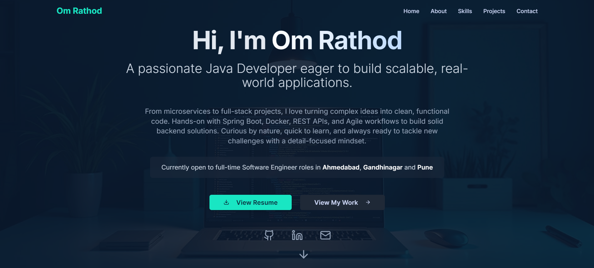

---

# Om Rathod - Personal Portfolio Website



<p align="center">
  <a href="[YOUR_VERCEL_APP_URL]" target="_blank">
    
  </a>
  <a href="https://www.linkedin.com/in/omrathod357/" target="_blank">
    
  </a>
  <a href="https://github.com/Om357" target="_blank">
    
  </a>
</p>

## 📋 About The Project

This is my personal portfolio website, designed to showcase my skills, projects, and professional experience as a Software Engineer. Built from the ground up with a modern tech stack, this project serves as a central hub for my work and a primary point of contact for potential employers and collaborators.

The website is fully responsive, optimized for performance, and features a clean, professional user interface.

### ✨ Key Features

*   **Modern & Responsive Design:** A clean, mobile-first design that looks great on any device.
*   **Interactive UI:** Smooth animations and hover effects provide an engaging user experience.
*   **Dynamic Project Showcase:** Sections to display my featured projects with descriptions, tech stacks, and links to code and live demos.
*   **Functional Contact Form:** A secure contact form that uses **Resend** and **Vercel Serverless Functions** to deliver messages directly to my inbox.
*   **Optimized for Performance:** Built with Vite for lightning-fast load times and a snappy user experience.

---

## 🛠️ Tech Stack

This project was built using the following technologies:

| Category          | Technologies                                                                                             |
| ----------------- | -------------------------------------------------------------------------------------------------------- |
| **Frontend**      |     |
| **Backend**       |   |
| **Tooling & Deployment** |    |

---

## 🚀 Getting Started

To get a local copy up and running, follow these simple steps.

### Prerequisites

*   Node.js (v18 or higher recommended)
*   npm or bun package manager

### Local Development Setup

1.  **Clone the repository:**
    ```sh
    git clone https://github.com/Om357/your-portfolio-repo-name.git
    ```

2.  **Navigate to the project directory:**
    ```sh
    cd your-portfolio-repo-name
    ```

3.  **Install dependencies:**
    ```sh
    npm install
    ```

4.  **Set up environment variables:**
    Create a new file named `.env.local` in the root of your project and add your Resend API key. This is required for the contact form to work locally.
    ```
    RESEND_API_KEY=re_your_api_key_here
    ```

5.  **Start the development server:**
    ```sh
    npm run dev
    ```
    Open [http://localhost:5173](http://localhost:5173) (or the URL provided in your terminal) to view the project in your browser.

---

## 📫 Contact Me

**Om Rathod**

*   **Email:** [om.rathod2004.or@gmail.com](mailto:om.rathod2004.or@gmail.com)
*   **LinkedIn:** [https://www.linkedin.com/in/omrathod357/](https://www.linkedin.com/in/omrathod357/)
